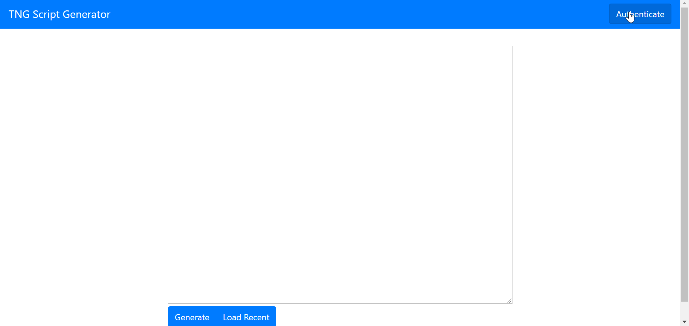
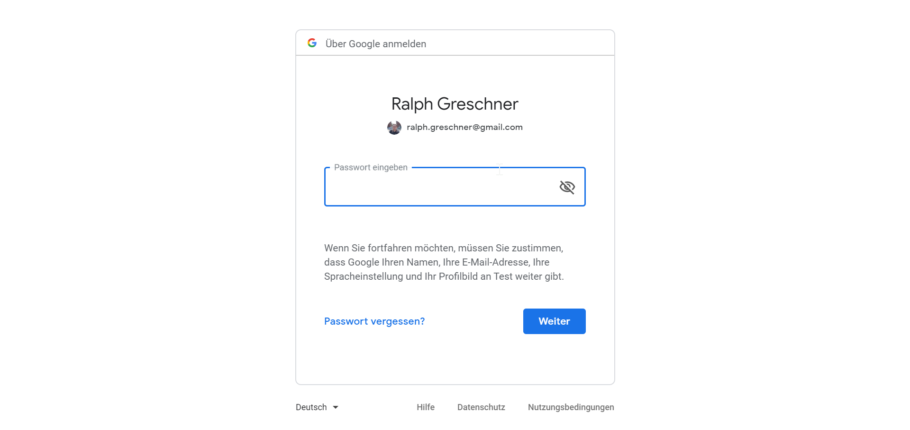
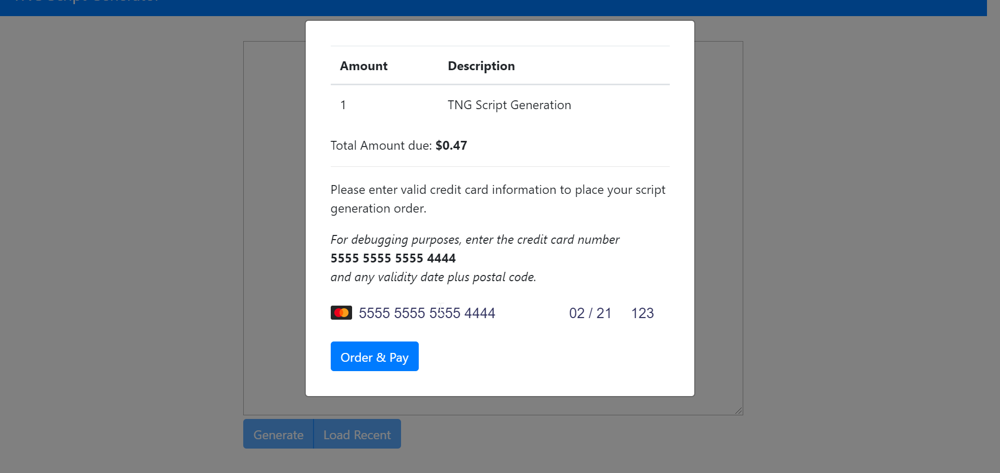
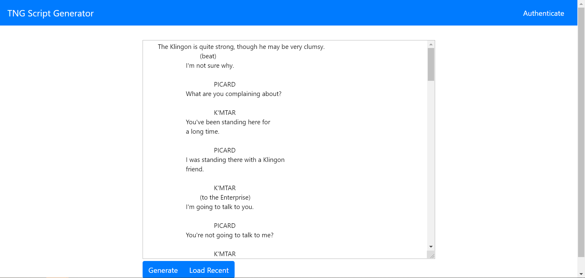

# Make Money with Machine Learning Course by Siraj Raval - Midterm Assignment: TNG Script Generator

## Introduction

This repository contains my midterm assignment of Make Money with Machine Learning Course by Siraj Raval.

For this assignment, I decided to develop a MVP for a text generation webtool which lets users generate episode scripts for a television show, in this particular case for "Star Trek: The Next Generation".

## Use Case for the MVP

My use case for the MVP was to provide a service which supplies AI-generated transcripts of entirely new episodes of "Star Trek: The Next Generation" to user.

A demo video is available on YouTube.

[Demo Video](https://www.youtube.com/watch?v=K4_LOrml6Z4)

### Basic User Interaction

The basic user interaction is like this:

1. For **user login**, the user authenticates inside the app using Google OAuth. All further backend calls are secured by a JWT from then on.





2. After authentication, the **user orders a new AI-generated transcript in a pay-to-access manner**. In order to do this, they got to enter **payment details using Stripe** first.



3. The system starts to generate a script in the background. After a waiting time of a few minutes, a newly **AI-generated script** is displayed to the user.



### Limitations of the MVP

For the MVP the following limitations are in place:

* simplistic user management using Google OAuth and JWT, e.g. no user sign-up
* simplistic UI/UX in the style of KISS (Keep It Simple Stupid), I'm not going designer on this
* no persistence of generated scripts for now, but the backend is prepared to support a proper database instead of an in-memory mock datastore by using the Repository/DAO pattern whenever necessary
* no scalability, especially in the script generation process (for the MVP this is done using a simple Python script whereas in a full blown production environment, dedicated microservices would perform the script generation tasks via job queue)
* payment options include Stripe and only Stripe
* only scripts of "Star Trek TNG" shall be generated, later on this could be expanded to generate scripts for "Stranger Things", Marvel Movies or other stuff :)

### Realization Steps

The realization steps where are detailed below.

#### 1. Doing Research

A first step was to do the necessary research of what tasks need to be done to achieve feature-completeness for the MVP.

This entailed tasks such as researching what frameworks could be used (I decided to go with Node.js, Angular, NestJS and a shell-wrapped Python script using gpt-2-simple because I got the most experience with those), how authentication using Google OAuth and JWT could be done (I found an article on Medium for this, [Auth in Nest.js and Angular
 by Niels Meima](https://medium.com/@nielsmeima/auth-in-nest-js-and-angular-463525b6e071)) how to integrate Stripe as a payment provider, whether there were any libraries or similar tools on GitHub etc.

#### 2. Model Training

The model for the GPT-2 Text Generation I had from an earlier experiment, so I decided to reuse it.

For data preparation, I wrote a simple script which concatenates all episodes of "Star Trek TNG" available in text-form from [Star Trek Minutiae (All TNG Episodes ZIP)](http://www.st-minutiae.com/resources/scripts/index.html#thenextgeneration).

This concatenated corpus was then fed into the Jupyter Notebook [Train a GPT-2 Text-Generating Model w/ GPU For Free](https://colab.research.google.com/drive/1VLG8e7YSEwypxU-noRNhsv5dW4NfTGce) by @minimaxir for doing transfer learning running on Google Colab.
The training process for the smaller GPT-2 model took about 4 hours, for details of the process see [How To Make Custom AI-Generated Text With GPT-2](https://minimaxir.com/2019/09/howto-gpt2).

The trained model is supplied in a [separate repository on GitHub](https://github.com/rgreschner/siraj-make-money-with-machine-learning-midterm-tng-scriptgen-data) and referenced in this project repository as Git submodule.

#### 3. Implementation of the Backend and Script Generator

The next step was to implement the backend and the script generator. Using NestJS, its accompanying code scaffolding tools and the Medium article outlined below this was easily done in a few hours.

For the first tests I went without user authentication and just started the Python Script Generator using a command-line wrapper called [ShellJS](https://www.npmjs.com/package/shelljs) until I had a state where simplistic script generation and retrieval using an HTTP-endpoint was possible.
In a proper production environment the task of script generation would be scaled to a proper microservice architecture where multiple worker services for script generation were running in the background using a job queue for scalability.

Then I added Google OAuth and JWT in conjunction with building up the frontend.

#### 4. Implementation of the Frontend

In the later stages of backend implementation I began with implementing the UI in Angular as a SPA.
The components and route for the script generation UI I added first and then went on to user authentication after the functionality was available in the backend.

Later parts of the frontend development involved the integration of Stripe and generic improvements like error handling, retrieval of the most recently generated script etc.

#### 5. Grinding and Polishing

For the finishing steps I decided to write a Dockerfile, write some documentation, squash all of my Git commits for the public drop on GitHub and am trying to deploy it to a hosted cloud-services provider.

## Build Steps

This is a rough outline of the steps necessary to build the whole project. This is heavily focused on building a version using the supplied [Dockerfile](./Dockerfile), also see this for details.

### 1. Install Node Modules

`npm i` needs to be run in every Node.js project, e.g. `packages/frontend` and `packages/backend`.

### 2. Install Python Packages

`pip3 install -r requirements.txt` needs to be run for the Python Script Generator Project residing in `packages/scriptgen`.

### 3. Adjust System Configuration

Because Google OAuth is used for the user authentication flow, settings like `GOOGLE_CLIENT_ID`, `GOOGLE_CLIENT_SECRET` and `JWT_SECRET_KEY` need to be adjusted in the backend configuration file `packages/backend/development.env`.

If you are not running on `localhost`, the host setting needs to be changes as well in both the backend configuration file `packages/backend/development.env` and the corresponding frontend environment file `frontend/src/environments/environment.ts`.

### 4. Build & Run Docker Image

For a simple environment setup, use the supplied `Dockerfile`.

In a shell, run this in the repository root (only tested on Ubuntu and Docker with WSL on Windows for now):

```
npm run prep-frontend
npm run build-docker
docker run -d -p 3000:3000 --name siraj-midterm siraj-midterm
```

By default, this will start an HTTP server providing an API and serve the frontend at [http://localhost:3000](http://localhost:3000).

## License

The trained model is available under the terms of the **MIT** license, see [LICENSE](./LICENSE) for details.